# ToaruOS-Arnold v4.0

**"COME WITH ME IF YOU WANT TO BOOT"**

A complete desktop operating system written entirely in ArnoldC — the programming language where every keyword is an Arnold Schwarzenegger movie quote. No C. No Rust. Just pure Arnold running on bare metal x86.

## What Is This?

This is a real, bootable operating system kernel that provides:

- 🚀 **Animated boot splash** with 3x scaled title, loading bar, and Arnold quotes
- 🖥️ **Full desktop GUI** with menu bar, taskbar with RTC clock, and 8 clickable icons
- 🪟 **Window manager** with overlapping windows, drag, z-ordering, and focus
- 🎮 **5 playable games** (Snake, Pong, Breakout, Chopper, Skynet Defense)
- 📟 **Terminal emulator** with keyboard input, command prompt, and 35 commands
- 🧮 **Calculator app** with button grid UI
- 📝 **Text editor** with full keyboard input, enter, backspace, cursor blink
- 🎨 **Settings app** with 5 Arnold movie color themes (runtime theming)
- 📁 **File manager** with virtual filesystem navigation
- ℹ️ **About dialog** with T-800 skull pixel art
- 🎬 **DVD bouncing screensaver** — "I'LL BE BACK" bounces around after 30s idle, cycling through 5 Arnold movie colors on each wall hit
- 🌐 **Full network stack** — E1000 NIC driver, ARP, ICMP ping, TCP, HTTP client
- 🔗 **wget command** — Fetches real webpages over TCP/HTTP with HTML tag stripping
- 📋 **Start menu** — Tab-activated popup with all apps and games listed
- 🎮 **Game window frames** — All 5 games render inside windows with title bars and close buttons
- 🔮 **Easter eggs** — `fortune` (random Arnold quotes), `cowsay` (ASCII art Arnold), `matrix` (Matrix rain effect), `neofetch` (ASCII Terminator + system stats), `shutdown` (dramatic service termination)
- ⚡ **Native fast rendering** — `rep stosd` assembly for ~100x fillRect speedup
- 🖱️ **Arrow cursor** — Classic 12x16 pointer with black outline, visible on any background
- 🎨 **Wallpaper dot grid** — Subtle dotted pattern across desktop, theme-aware
- 📋 **Right-click context menu** — 5 color-coded items (Terminal, Settings, About, Screensaver, Refresh)
- 🖼️ **3D desktop icons** — Raised button effect with light/dark border highlights
- 👋 **Terminal welcome banner** — Shows "ToaruOS-Arnold v4.0" and help hint on first open

- 🔐 **Login screen** — "Welcome, User / Loading desktop..." transition between boot and desktop
- ⏰ **Live desktop clock** — HH:MM:SS + MM/DD/YY in large centered display, ticks every second
- 💀 **Visual shutdown** — Reverse loading bar + "Hasta la vista, baby." in giant red text, then halt

All written in **22,000+ lines** of ArnoldC + **3,000 lines** of x86 assembly across **22 modules**, compiled to a **213KB ELF** with **185 ArnoldC functions + 108 native assembly routines**, running directly on bare metal x86 (or QEMU).

**75 commits** • **36 terminal commands** • **5 games** • **6 desktop apps** • **TCP/IP networking**

📹 **[Demo Video](build/demo.mp4)** — 54-second tour of every feature

## Screenshots

### Boot → Login → Desktop
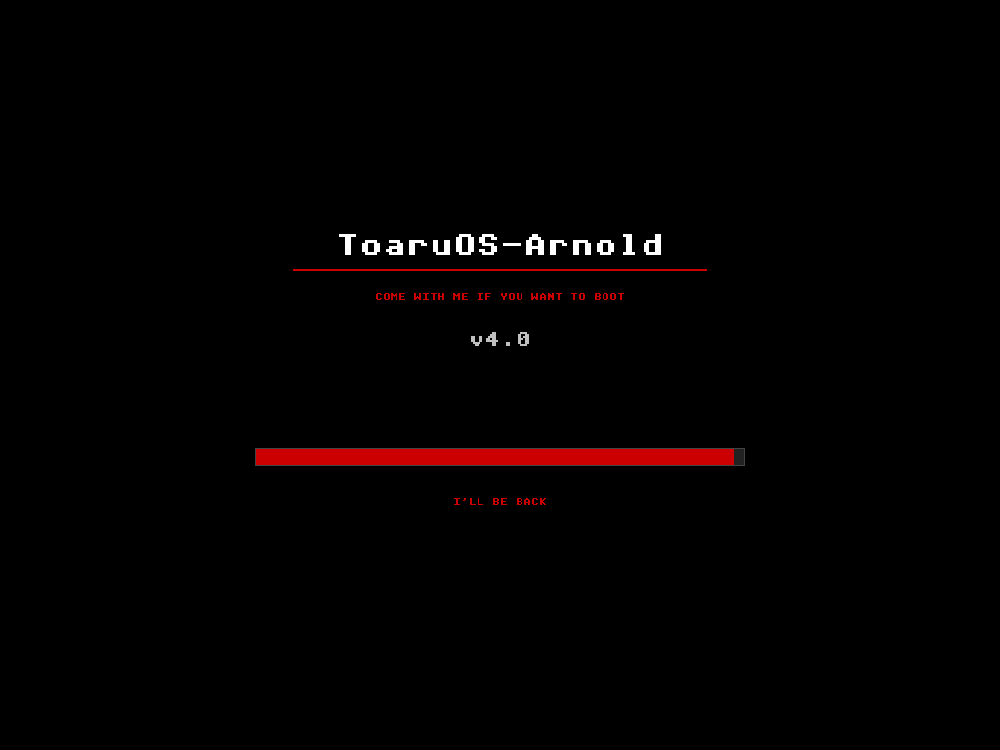
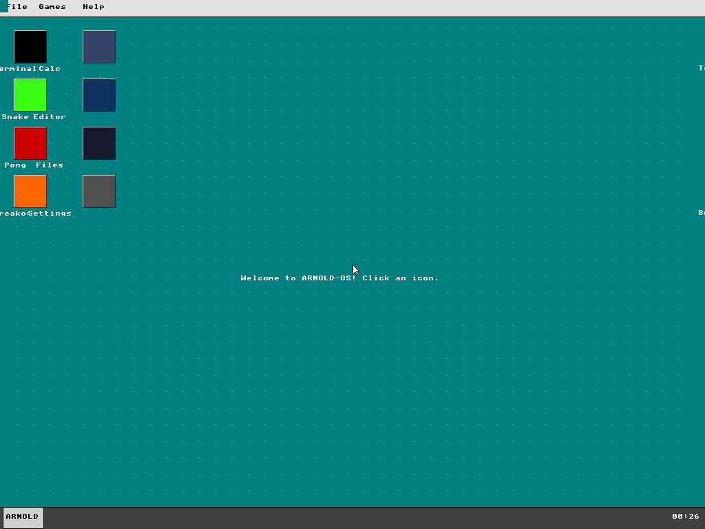
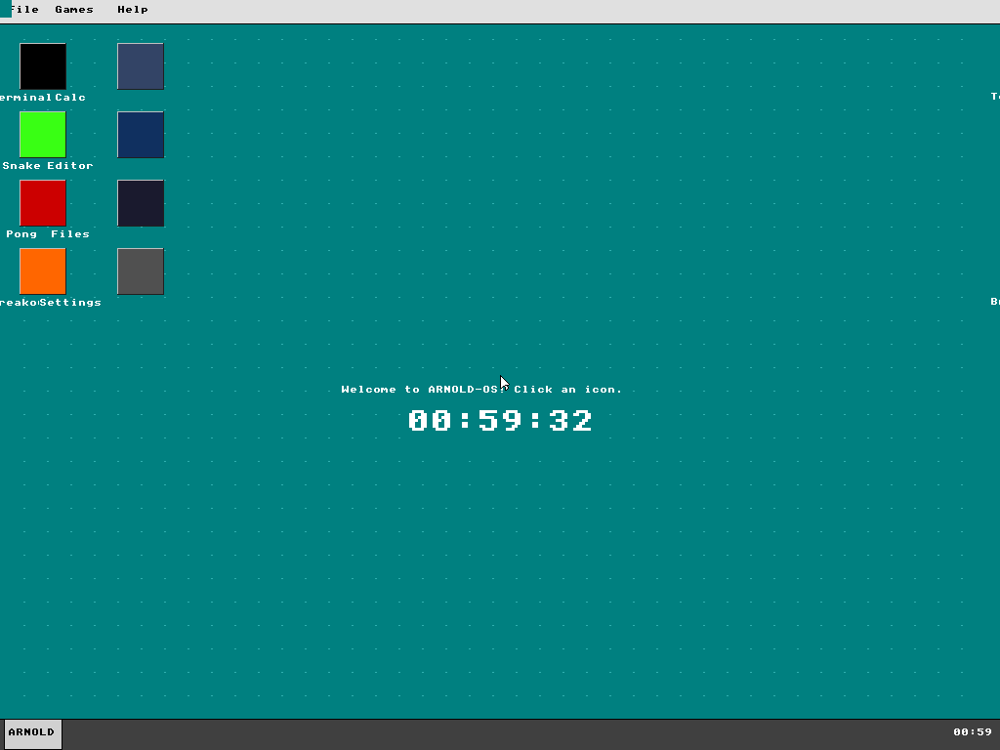

### Terminal (35 commands)
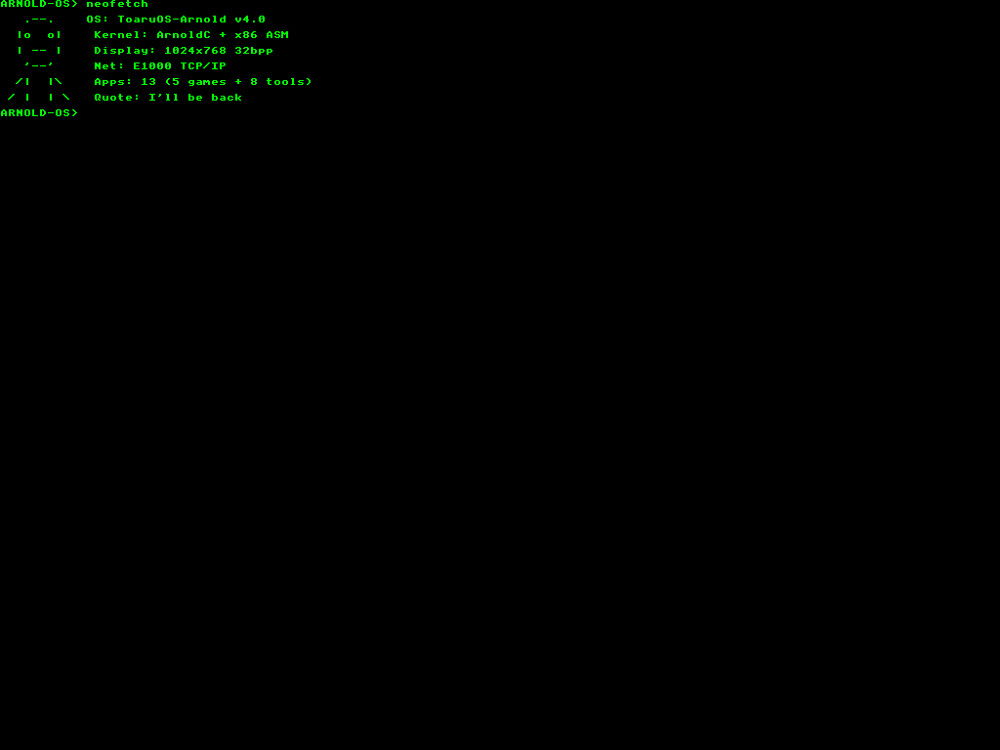
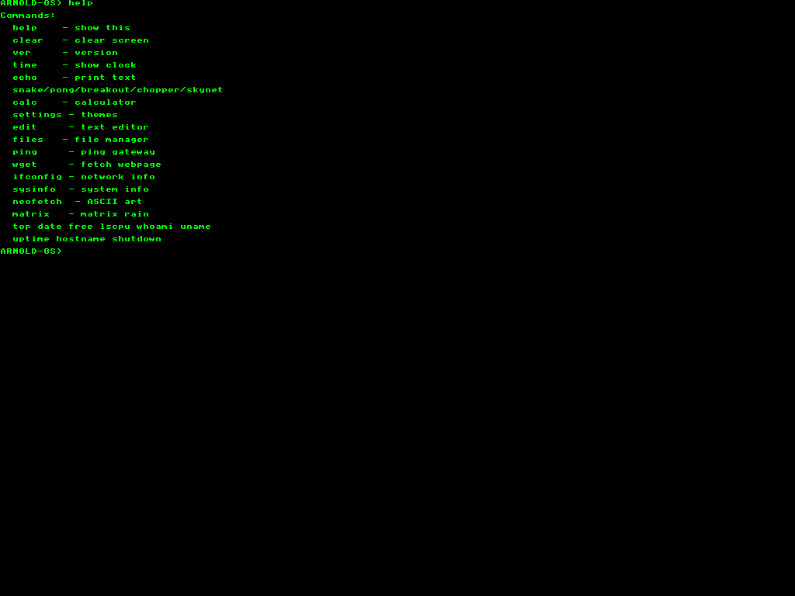

### Games in Windows
All 5 games render inside floating windows with the desktop visible behind.

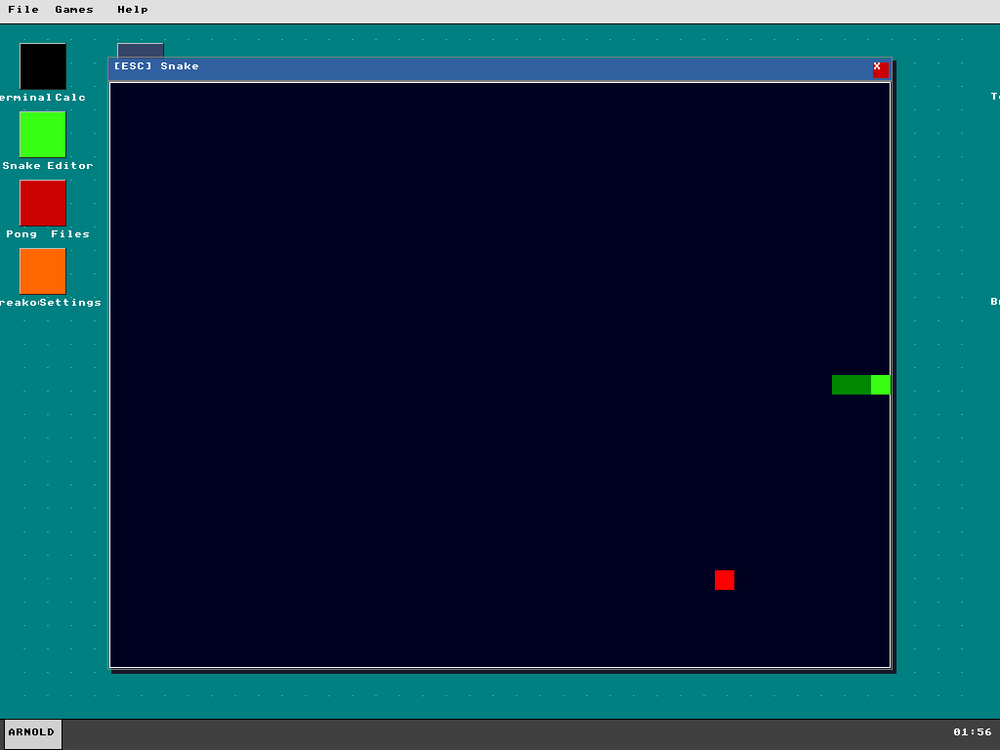
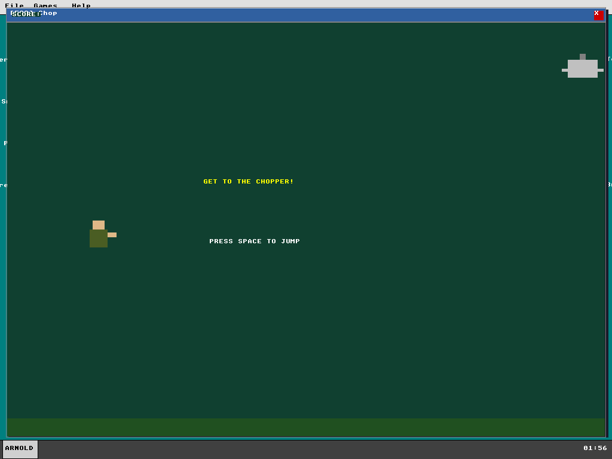
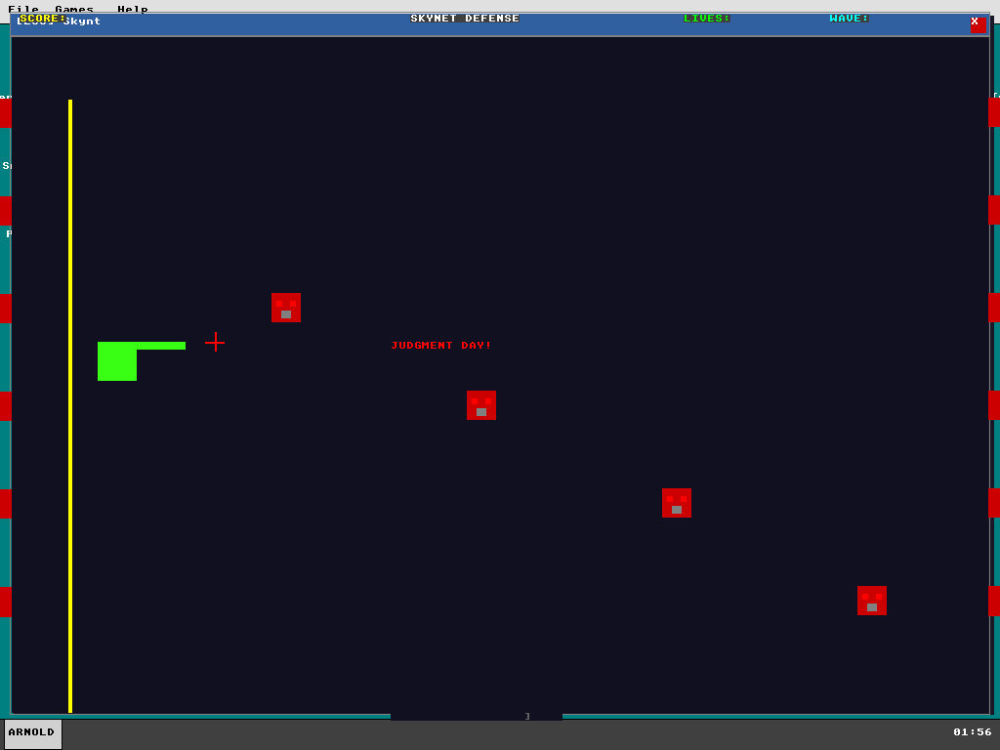

### Desktop Features
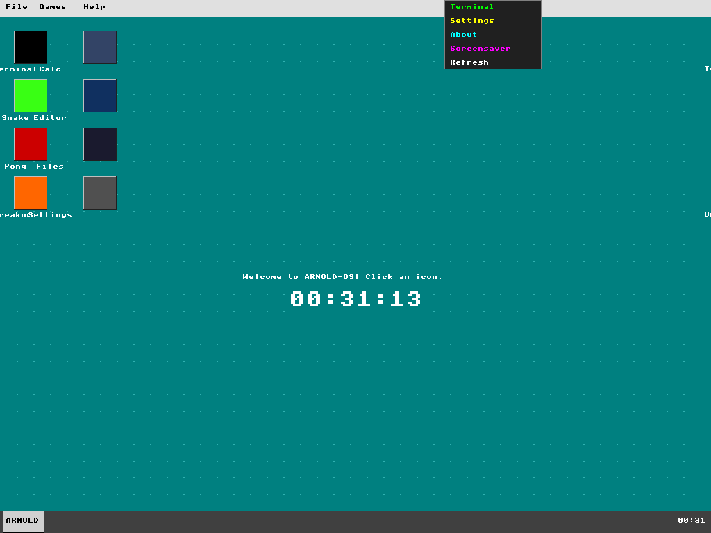
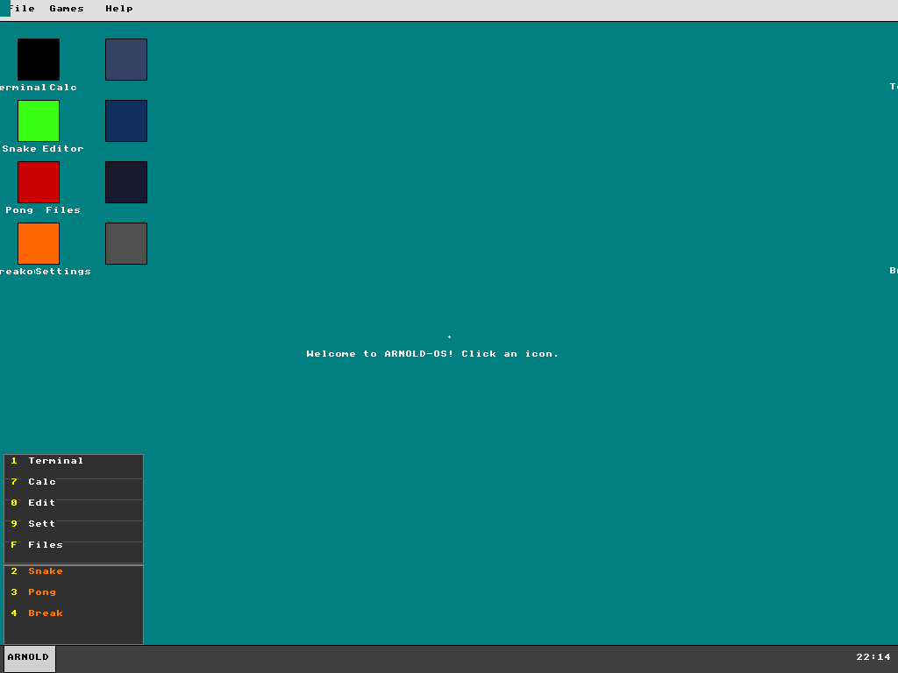


### Networking & Easter Eggs
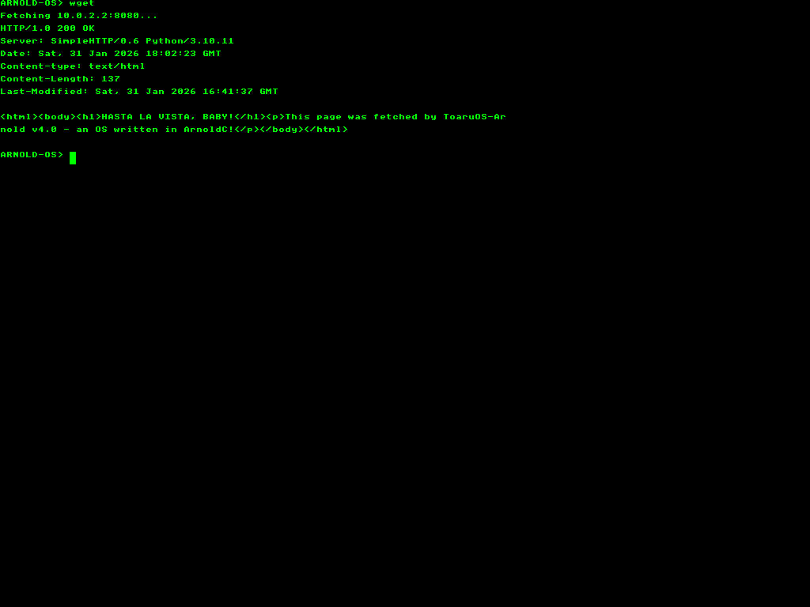
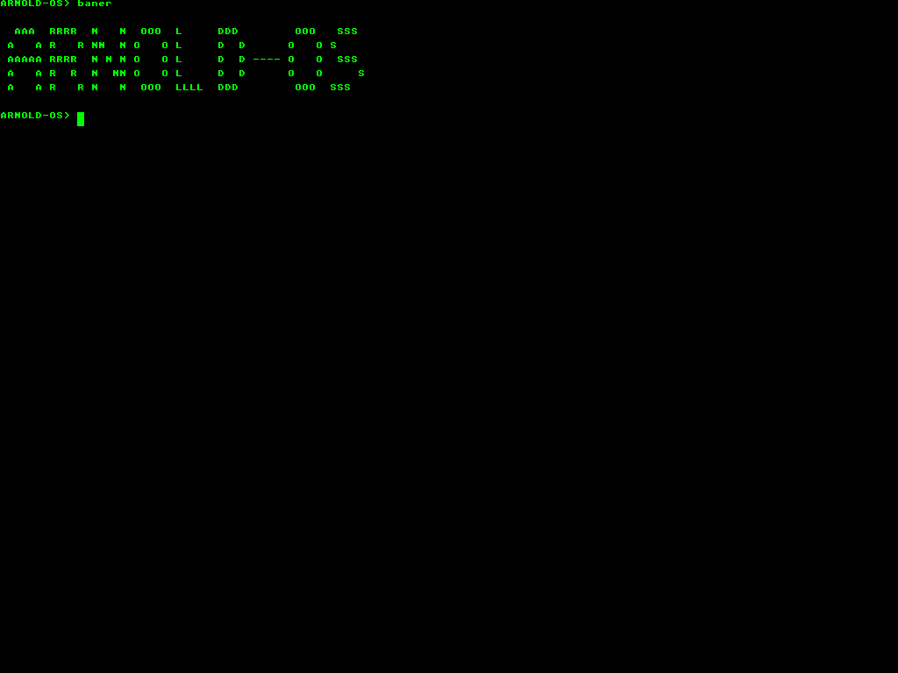
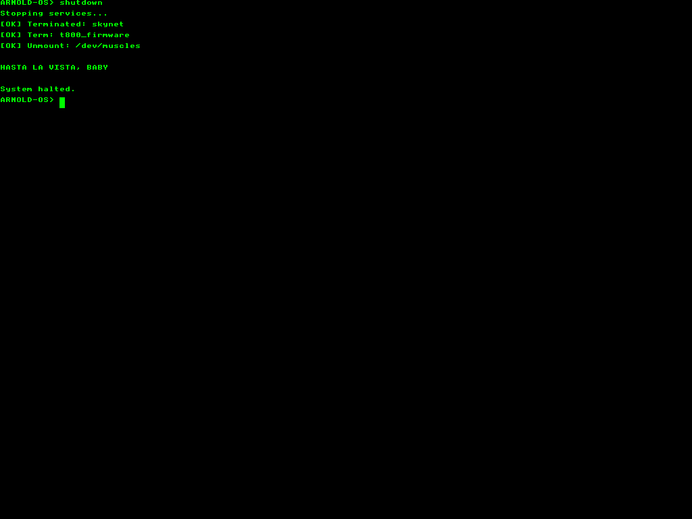

### Neofetch
```
   .---.     OS: ToaruOS-Arnold v4.0
  |o   o|    Kernel: ArnoldC + x86 ASM
  | --  |    Display: 1024x768 32bpp
   '--'      Net: E1000 TCP/IP
  /|   |\    Apps: 13 (5 games + 8 tools)
 / |   | \   Quote: I'll be back
```

### Shutdown
```
ARNOLD-OS> shutdown
Stopping services...
[OK] Terminated: skynet
[OK] Term: t800_firmware
[OK] Unmount: /dev/muscles

HASTA LA VISTA, BABY

System halted.
```

### Calculator
4×4 button grid: gray number buttons, orange operators, blue equals, green LED display (key: 7)

### Settings
5 Arnold movie color themes: Classic Teal, Terminator Red, Predator Green, Total Recall Mars, Conan Gold (key: 9)

### Text Editor
80×32 character grid with dark blue theme, full keyboard input, enter/backspace, cursor blink (key: 0)

### File Manager
Virtual filesystem with directory navigation, [D]/[F] indicators, selection highlighting (key: F)

### About
Dialog with T-800 pixel art skull, version info, "I'll be back." quote (key: 8)

### Networking
```
ARNOLD-OS> ifconfig
IP:  10.0.2.15
GW:  10.0.2.2
MAC: 52:54:00:12:34:56
Link: Up

ARNOLD-OS> ping
Pinging gateway 10.0.2.2...
Reply: 1 ticks (10ms)

ARNOLD-OS> wget
Fetching 10.0.2.2:8080...
HTTP/1.0 200 OK
Server: SimpleHTTP/0.6 Python/3.10.11
Content-type: text/html
Content-Length: 137

<html><body><h1>HASTA LA VISTA, BABY!</h1>
<p>This page was fetched by ToaruOS-Arnold v4.0</p></body></html>
```

## Building

### Requirements

- **ArnoldC-Native compiler** — Custom fork that generates x86 NASM assembly
- **NASM** — Netwide Assembler
- **i686-elf toolchain** — Cross-compiler linker (`i686-elf-ld`)
- **Java 17+** — For ArnoldC-Native (Scala-based)
- **QEMU** — For testing (`qemu-system-i386`)
- **PowerShell** — Build scripts are Windows PowerShell

### Quick Build (Windows)

```powershell
# Build everything (merge modules → compile → assemble → link)
.\build_v3.ps1

# Run in QEMU (basic)
& "C:\Program Files\qemu\qemu-system-i386.exe" -m 128M -vga std -kernel build\toaruos-arnold.elf

# Run with networking (for wget/ping)
& "C:\Program Files\qemu\qemu-system-i386.exe" -m 128M -vga std -kernel build\toaruos-arnold.elf `
  -netdev user,id=n1 -device e1000,netdev=n1
```

### Build Pipeline

```
ArnoldC source files (.arnoldc)
    ↓ merge_modules.ps1 (merge + dedup)
Single merged kernel.arnoldc
    ↓ ArnoldC-Native compiler
x86 NASM assembly (kernel.asm)
    ↓ NASM assembler
ELF object (kernel.o)
    ↓ i686-elf-ld linker
Bootable ELF kernel (toaruos-arnold.elf)
```

## Keyboard Controls

| Key | Action |
|-----|--------|
| 1 | Launch Terminal |
| 2 | Launch Snake |
| 3 | Launch Pong |
| 4 | Launch Breakout |
| 5 | Launch Chopper |
| 6 | Launch Skynet Defense |
| 7 | Launch Calculator |
| 8 | About Dialog |
| 9 | Settings (Themes) |
| 0 | Text Editor |
| F | File Manager |
| W | Open new window |
| Tab | Toggle start menu |
| ESC | Return to desktop |

## Architecture

```
boot/
  multiboot.asm          — Multiboot bootloader, VBE 1024×768×32, IRQs, mouse, PIT,
                           E1000 NIC driver, ARP/IP/ICMP/TCP/HTTP network stack
kernel/
  kernel_v3.arnoldc      — Main kernel: desktop, input loop, rendering, font
  window_manager.arnoldc — Window system: create/close/drag/z-order/taskbar
  terminal.arnoldc       — Terminal emulator: 80×25 buffer, scancode mapping
  terminal_commands.arnoldc — 35 commands: help, ver, time, echo, clear, sysinfo,
                             neofetch, matrix, fortune, cowsay, shutdown, wget,
                             ifconfig, ping, banner, logo, colors, about,
                             top, date, free, lscpu, whoami, uname, uptime,
                             hostname, + game/app launchers
  lib/
    random.arnoldc       — PRNG (timer-seeded)
    timer.arnoldc        — PIT timer access
    speaker.arnoldc      — PC speaker (stub)
  games/
    snake.arnoldc        — Snake game
    pong.arnoldc         — Pong game
    breakout.arnoldc     — Breakout with rainbow bricks
    chopper.arnoldc      — Helicopter obstacle game
    skynet.arnoldc       — Turret defense game
    memory.arnoldc       — Memory card game (WIP)
    tictactoe.arnoldc    — Tic-tac-toe (WIP)
  apps/
    calculator.arnoldc   — Calculator with 4×4 button grid
    about.arnoldc        — About dialog with T-800 pixel art
    settings.arnoldc     — 5 Arnold movie themes with runtime color switching
    text_editor.arnoldc  — 80×32 text editor with full keyboard input
    file_manager.arnoldc — Virtual filesystem browser with directory navigation
    easter_eggs.arnoldc  — fortune, cowsay, neofetch, matrix, shutdown commands
    browser.arnoldc      — Text-mode web browser (WIP)
test_www/
  index.html             — Test page for wget ("HASTA LA VISTA, BABY!")
linker.ld                — Kernel memory layout
tools/
  merge_modules.ps1      — Module merger with dedup
  test_*.ps1             — Automated QEMU test scripts (30+ test scripts)
  parse_pcap.py          — Network packet capture analyzer
  verify_cksum.py        — TCP/IP checksum verifier
```

## Technical Details

- **Language:** ArnoldC (compiled to x86 assembly) + hand-written x86 assembly for networking
- **Graphics:** Bochs VBE, 1024×768, 32-bit color, linear framebuffer
- **Input:** PS/2 keyboard (IRQ1 + scancode ISR), PS/2 mouse (IRQ12)
- **Networking:** E1000 NIC (PCI MMIO), ARP, IPv4, ICMP, TCP, HTTP/1.0 client
- **Font:** Custom 8×8 bitmap, full ASCII 32-126
- **ELF Size:** ~201 KB
- **Functions:** 184 across all source modules
- **ELF size:** 212KB (212,240 bytes)
- **Source lines:** 21,359 (ArnoldC + x86 assembly)
- **Modules:** 22 (kernel, terminal, 5 games, 6 apps, 3 libs, assembly runtime)
- **Commits:** 70+
- **Modules:** 21 ArnoldC source files + 1 assembly (6000+ lines)
- **Terminal Commands:** 35
- **Commits:** 59+
- **Boot time:** ~4 second splash screen, then desktop

### ArnoldC Challenges

Writing an OS in ArnoldC required creative solutions:

- **No early return** — `I'LL BE BACK` sets a value but doesn't exit. Used flag-based patterns instead.
- **Calculator arithmetic** — ArnoldC evaluates left-to-right like a calculator: `a * b + c * d` becomes `((a*b)+c)*d`. Must restructure expressions.
- **No string operations** — Every text string is drawn character-by-character with ASCII codes.
- **Performance** — Original `fillRect` called `putPixel` per pixel (786K calls for full-screen). Solved with native `rep stosd` assembly (~100x speedup) and dirty-rect rendering.
- **No negative numbers** — Unsigned 32-bit only. Bouncing animations use clamp-before-subtract and direction flags.
- **No function-local arrays** — Compiler silently ignores array declarations inside functions. All data arrays must be at module scope.
- **Comparison operator confusion** — `LET OFF SOME STEAM BENNET` means `>` (not `<`!). `YOU ARE NOT ME` means `!=` (not `>`). Many hours lost to this.
- **Network byte order** — x86 is little-endian, network is big-endian. Every protocol field needs manual byte swapping. ArnoldC only has 32-bit integers, so byte-level packet construction lives in assembly.
- **TCP from scratch** — Full 3-way handshake, sequence tracking, checksum with pseudo-header, FIN teardown. Debugging with PCAP captures and hex serial output.
- **`mov dx` corrupts `edx`** — x86 partial register writes! Serial debug (`mov dx, 0x3F8`) was silently destroying the TCP header size stored in `edx`. The most insidious bug in the project.

## ArnoldC Syntax Quick Reference

```arnoldc
IT'S SHOWTIME                              ; main()
HEY CHRISTMAS TREE x                      ; declare variable
YOU SET US UP 42                           ; initialize
GET TO THE CHOPPER x                       ; begin assignment
HERE IS MY INVITATION 10                   ; load 10
GET UP 5                                   ; + 5
ENOUGH TALK                                ; end assignment
BECAUSE I'M GOING TO SAY PLEASE condition  ; if
BULLSHIT                                   ; else
YOU HAVE NO RESPECT FOR LOGIC              ; endif
STICK AROUND condition                     ; while
CHILL                                      ; endwhile
LISTEN TO ME VERY CAREFULLY funcName       ; function
I NEED YOUR CLOTHES YOUR BOOTS AND YOUR MOTORCYCLE param  ; parameter
I'LL BE BACK value                         ; return value
HASTA LA VISTA, BABY                       ; end function
DO IT NOW funcName arg1 arg2               ; call function
YOU HAVE BEEN TERMINATED                   ; end main
```

## Credits

- **ArnoldC Language** — Created by Lauri Hartikka
- **ArnoldC-Native** — Custom compiler generating x86 assembly
- **Inspired by** — ToaruOS, Windows 95, and every Arnold movie ever made

## Support This Project

If you enjoyed this insanity, consider supporting the project:

- ⭐ **Star this repo** — it helps more than you think
- 💖 **[GitHub Sponsors](https://github.com/sponsors/Cuuper22)** — monthly support
- ☕ **[Ko-fi](https://ko-fi.com/cuper22)** — one-time donation
- 🔀 **Share it** — tell people an OS exists where variables are declared with "HEY CHRISTMAS TREE"

## License

MIT License

---

*"CONSIDER THAT A DIVORCE from boring operating systems!"*

*"TALK TO THE HAND if you think this can't be done in ArnoldC."*

*"I'LL BE BACK... with more features."*
